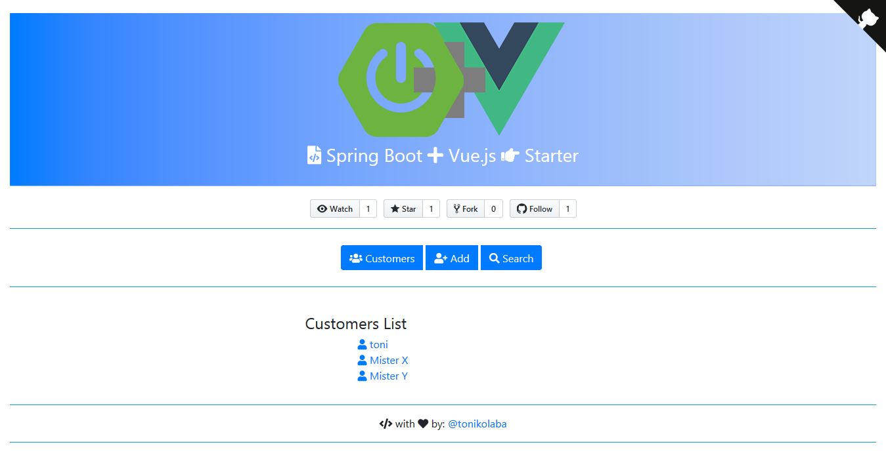
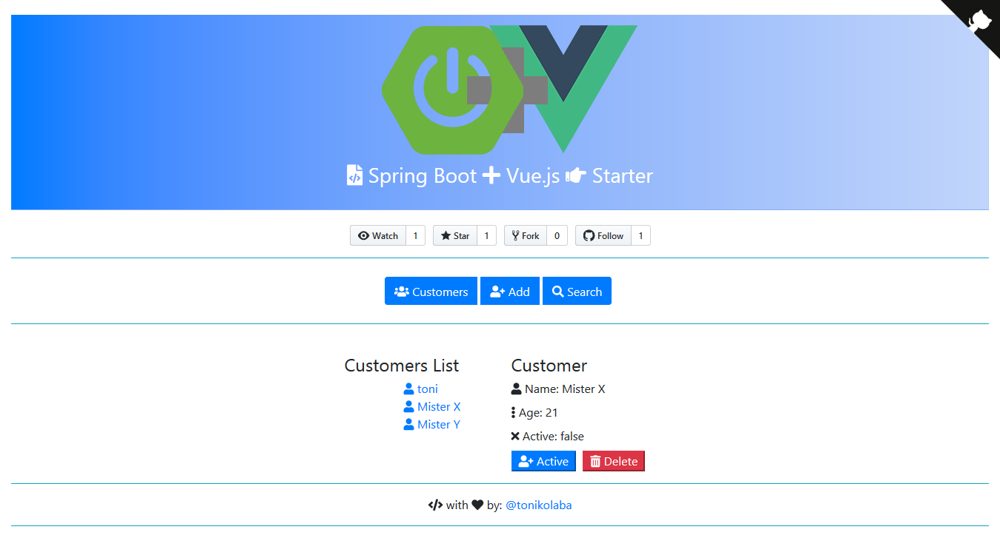
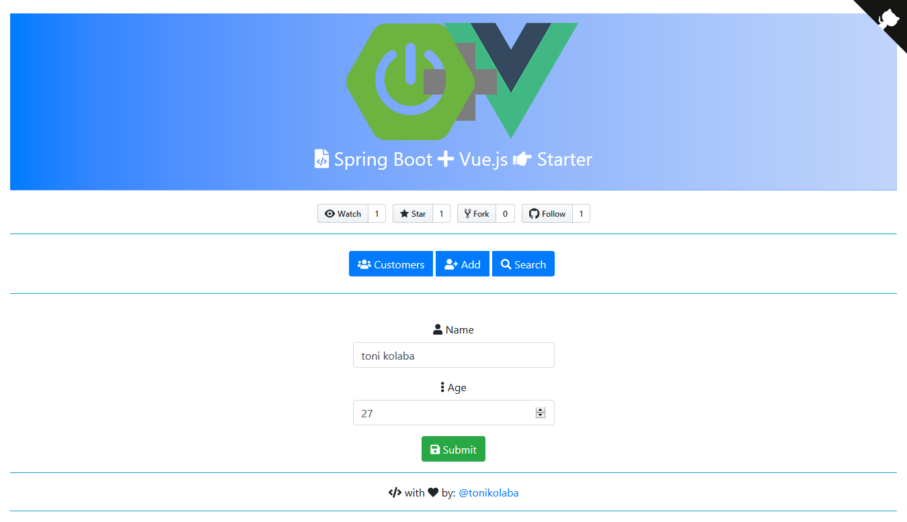
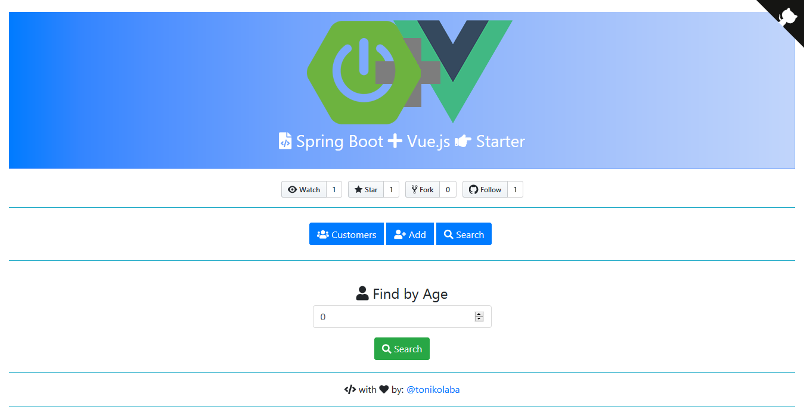

#  Spring Boot :heavy_plus_sign: Vue.js :x: Starter 


### :telescope: Demo





### :octocat: :open_file_folder: Tech :

- Spring Boot
- Vue.js
- Node.js
- Maven
- Bootstrap-Vue
- Fontawesome-Vue
- H2 Database
- Java
- Webpack


### Before start

Project requires [Node.js](https://nodejs.org/) v4+ to run. Before you started using this project make sure you have installed this programs in your computer:

* [Java](https://www.oracle.com/java/) - is the world’s #1 programming language.
* [Node.js](https://nodejs.org/en/) - Node.js® is a JavaScript runtime built on [Chrome's V8 JavaScript engine](https://v8.dev/).
* [Maven](https://maven.apache.org/) - is a software project management and comprehension tool.
* [H2 Database](http://h2database.com) - the Java SQL database (not nececary request).
* Read some information about [Spring Boot Framework](https://spring.io/projects/spring-boot)


### :open_file_folder: Project

Project is currently extended with the following plugins. Instructions on how to use them in your own application are linked below.

| spring-vuejsxstarter | README |
| ------ | ------ |
| spring-vuejsxstarter | [/README.md][PlDb] |
| backend-spring | [backend-spring/README.md][PlGh] |
| frontend-vue | [frontend-vue/README.md][PlGd] |


   [PlDb]: <https://github.com/tonikolaba/spring-vuejsxstarter/README.md>
   [PlGh]: <https://github.com/tonikolaba/spring-vuejsxstarter/backend-spring/README.md>
   [PlGd]: <https://github.com/tonikolaba/spring-vuejsxstarter/frontend-vue/README.md>


### :computer: Installation


:heavy_dollar_sign: git clone https://github.com/tonikolaba/spring-vuejsxstarter.git 

```sh
# open folder frontend-vue in CMD and install dependencies:
npm install
# serve with hot reload at localhost:4200 and let it run
npm run dev
#open Broweser
127.0.0.1:4200 or http://localhost:4200
# open main project in CMD and Install all dependeci in both projects:
mvn install
# runnig backend project and run:
mvn --projects backend spring-boot:run
```


### Developer

* **Toni Kolaba** - *Initial work* - [tonikolaba](https://github.com/tonikolaba)


